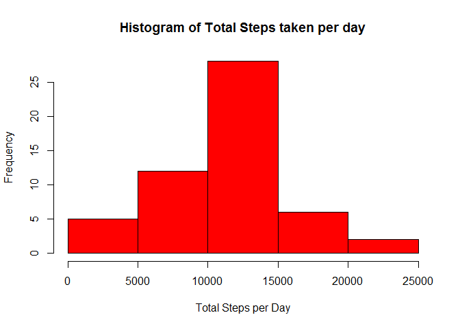
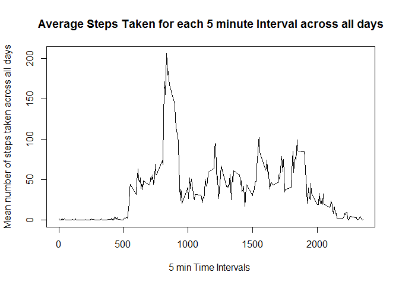
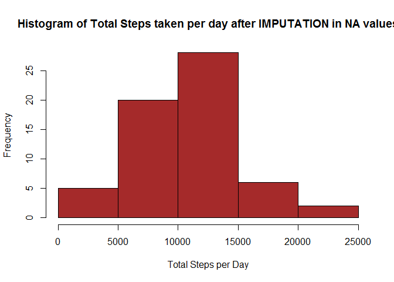
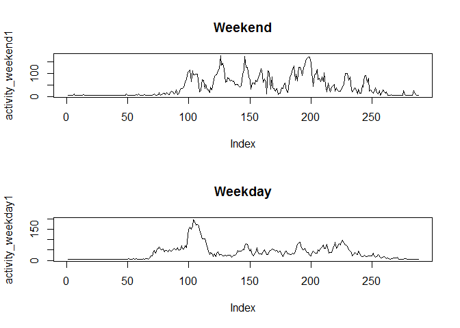

# Reproducible Research: Peer Assessment 1


## Loading and preprocessing the data


```r
activity <- read.csv("activity.csv")
activity$date <-as.Date(activity$date, "%Y-%m-%d")
```
Data loaded to dataframe **activity**.  
Coerce the date column into a date format.  


## What is mean total number of steps taken per day?

Calculate the total steps per date:  


```r
activity1  <- tapply(activity$steps, activity$date, sum)
```
The data frame **activity1** aggregates the steps for each date.  

### The histogram of the grouped data 


```r
hist(activity1, col = "red", xlab = "Total Steps per Day", ylab = "Frequency", 
    main = "Histogram of Total Steps taken per day")
```

 


The mean number of steps per day is **1.0766189\times 10^{4}**.  
The median number of steps is **10765**.  


## What is the average daily activity pattern?

### Problem? 
1.Split data by intervals.  
2.Calculate average of steps in each 5 minutes interval.  
3.Plot 5-minute interval on x axis with the average number of steps taken averaged across all the days on the y axis.  
4.Find the interval that contain maximum number of steps.     

###Compute mean of steps over all days by time interval


```r
mean_of_steps <- tapply(activity$steps, activity$interval, mean, na.rm = TRUE)
```

###Plot a line graph


```r
plot(row.names(mean_of_steps), mean_of_steps, type = "l", xlab = "5 min Time Intervals ", ylab = "Mean number of steps taken across all days", main = "Average Steps Taken for each 5 minute Interval across all days")
```

 


The step on which the max number of steps were taken on an average is **835**.  

## Imputing missing values


```
## [1] 2304
```

The total number of missing values is **2304**.  

###To impute NA values, I am using startegy to replace them with average number of steps over the entire dataset per each 5 min. interval

Filling up the missing values with dummy data (average steps per five-min intervals):  

```r
activity_clean <- activity
num_of_steps <- sum(na.omit(activity_clean$steps))
num_of_step_intervals <- nrow(activity_clean)
num_of_steps
```

```
## [1] 570608
```

```r
num_of_step_intervals
```

```
## [1] 17568
```

```r
activity_clean[is.na(activity$steps), ]$steps <- (num_of_steps/num_of_step_intervals)
```
###Histogram of the newly created data frame with imputed values:

```r
activity2  <- tapply(activity_clean$steps, activity_clean$date, sum)
hist(activity2, col = "brown", xlab = "Total Steps per Day", ylab = "Frequency", 
    main = "Histogram of Total Steps taken per day after IMPUTATION in NA values")
```

 


###The calculation of mean and median for the new data frame:  

```r
mean1 <-mean(activity2, na.rm = TRUE)
median1 <-median(activity2, na.rm = TRUE)
mean1
```

```
## [1] 10581.01
```

```r
median1
```

```
## [1] 10395
```

```r
mean_diff <- mean-mean1
median_diff <- median <- median1
```

The difference in means is **185.1749733** and in median is **1.0395\times 10^{4}**.  

## Are there differences in activity patterns between weekdays and weekends?

### Create a new column

```r
activity_clean$weekend_ornot <- ifelse(weekdays(activity_clean$date) %in% c("Satuday", "Sunday"), "weekend", "weekday")
```
### Create a plot to show the difference in 5 min. activity over weekend and weekdays

####Create two datasets with diff data

```r
activity_weekend <- activity_clean[which(activity_clean$weekend_ornot=="weekend"),]

activity_weekend1  <- tapply(activity_weekend$steps, activity_weekend$interval, mean, na.rm = TRUE)

activity_weekday <- activity_clean[which(activity_clean$weekend_ornot!="weekend"),]

activity_weekday1  <- tapply(activity_weekday$steps, activity_weekday$interval, mean, na.rm = TRUE)
```
### Plot the data to compare 


```r
par(mfrow = c(2, 1))
plot(activity_weekend1,  type = "l", main = "Weekend")
plot(activity_weekday1, type = "l", main = "Weekday")
```

 

The plots show that the weekend activity is more intense in the later part of the day.  
